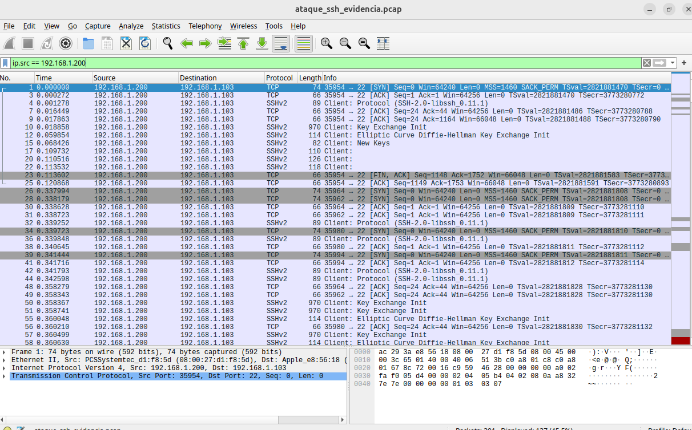
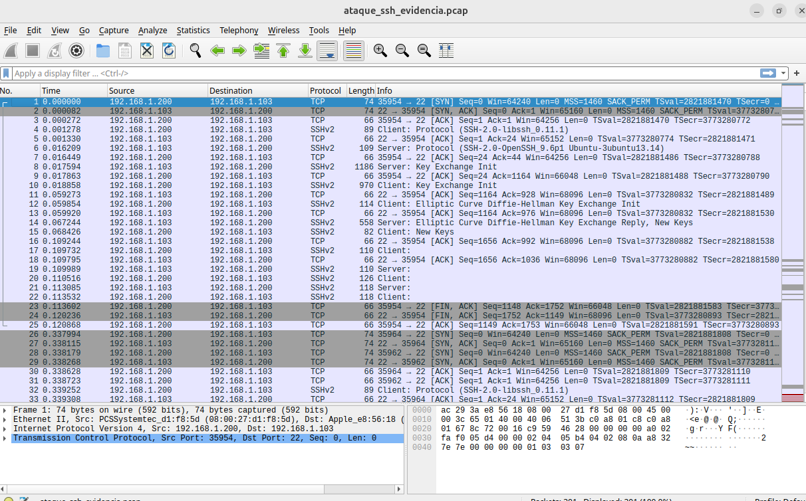

# 🕵️‍♂️ Network Forensics: Análise de Tráfego de Ataque SSH

## 📝 Resumo do Caso
Análise forense de rede (Packet Analysis) realizada após a detecção de um incidente de segurança. O objetivo foi interceptar e analisar o tráfego de rede para identificar a origem, o método e a volumetria de um ataque de Força Bruta contra o serviço SSH (Porta 22).

## 🛠️ Metodologia e Ferramentas
* **Captura:** `tcpdump` em modo promiscuo na interface de rede local.
* **Análise:** `Wireshark` para inspeção de pacotes, filtragem de conversas TCP e estatísticas de fluxo.
* **Alvo:** Servidor Linux (192.168.1.103).

---

## 🔍 Evidências Encontradas (Análise PCAP)

### 1. Identificação do Atacante (Filtro de IP)
Aplicando o filtro `ip.src == 192.168.1.200`, isolamos o tráfego malicioso vindo do Kali Linux.
Nota-se o padrão claro de ataque: centenas de pacotes sendo enviados em milissegundos, caracterizando uma ferramenta automatizada.

### 2. Fluxo de Protocolo (Packet List)
A captura detalhada mostra a negociação do protocolo **SSHv2**. É possível observar a repetição dos Handshakes TCP (SYN, SYN-ACK, ACK) seguidos de tentativas de troca de chaves, indicando múltiplas sessões sendo abertas e fechadas rapidamente.

### 3. Estatísticas de Conversação TCP
A ferramenta de "TCP Conversations" do Wireshark comprova a volumetria. O atacante abriu dezenas de portas altas (ex: 34622, 34628...) conectando consistentemente na porta 22 do alvo.
Cada conexão transferiu uma quantidade mínima de bytes (aprox 2kB - 3kB), consistente com falhas de login imediatas.

### 4. Estatísticas Gerais de Tráfego
O resumo estatístico confirma que o endereço `192.168.1.200` foi o maior gerador de pacotes na rede durante a janela de captura, validando-o como a fonte da anomalia.

---

## 📋 Conclusão Forense
A análise dos pacotes PCAP confirma um ataque de dicionário automatizado (Brute Force) originado em **192.168.1.200**. O padrão de tráfego (múltiplos handshakes TCP sem persistência de sessão) corrobora a tentativa de quebra de credenciais.

## 🛡️ Tecnologias
* Wireshark
* Tcpdump
* Protocolos TCP/IP & SSH
